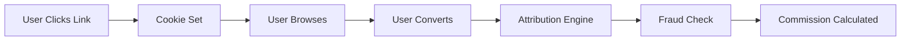

# How It Works

## 🎯 Campaign Flow

### 1. Organization Creates Campaign
- Define campaign goals and requirements
- Set commission structure (CPA, CPS, CPL, etc.)
- Configure fraud detection rules
- Set budget and payout limits

### 2. Affiliates Join Campaign
- Browse campaigns in marketplace
- Apply to promote campaigns
- Get approved by organization
- Receive unique tracking links

### 3. Affiliate Promotes
- Share tracking links on their channels
- Drive traffic to organization's site
- Users click affiliate links
- Tracking cookie is set

### 4. User Converts
- User completes desired action (signup, purchase, etc.)
- Conversion is tracked and attributed
- Fraud detection validates conversion
- Commission is calculated

### 5. Payout Processing
- Validated conversions are approved
- Commissions are calculated
- Payouts are processed
- Affiliates receive earnings

## 🔗 Attribution Flow



### Click Tracking
1. User clicks affiliate link with parameters: `?aff_id=123&camp_id=456`
2. Growvia SDK captures click data
3. Cookie is set with attribution data
4. Click is stored in Redis cache
5. Click record is saved to MongoDB

### Conversion Attribution
1. User completes conversion action
2. SDK reads attribution cookie
3. Finds matching click within conversion window
4. Applies attribution model (first-click, last-click, etc.)
5. Calculates commission based on model

## 🛡️ Fraud Detection

### Automatic Checks
- **IP Restriction**: Limit conversions per IP
- **Device Fingerprinting**: Detect suspicious patterns
- **Duplicate Prevention**: Block duplicate email/phone
- **Geo Validation**: Verify user location
- **Velocity Checks**: Detect conversion spikes

### Manual Review
- Organizations can manually approve/reject conversions
- Review suspicious patterns
- Investigate fraud flags
- Adjust fraud rules

## 📊 Data Flow

### Client-Side (Browser)
```javascript
// SDK captures events
growvia.trackClick()
growvia.trackSignup()
growvia.trackPurchase()
```

### Server-Side (API)
```
POST /api/v1/track
→ Validate request
→ Check fraud rules
→ Calculate attribution
→ Store in MongoDB
→ Cache in Redis
→ Return response
```

### Database Layer
- **MongoDB**: Permanent storage for events
- **Redis**: Fast cache for attribution
- **Indexes**: Optimized queries

## 🔄 Real-Time Updates

- Events are processed in real-time
- Dashboards update instantly
- Webhooks notify on conversions
- Analytics refresh automatically

## 🎨 Integration Options

### CDN Script
```html
<script src="https://cdn.growvia.io/growvia.min.js"></script>
```

### NPM Package
```bash
npm install @growvia/sdk
```

### REST API
```bash
curl -X POST https://track.growvia.io/api/v1/track
```

## 📈 Next Steps

- [Quick Setup (CDN)](./quick-setup-cdn)
- [Quick Setup (NPM)](./quick-setup-npm)
- [API Authentication](./api-authentication)
